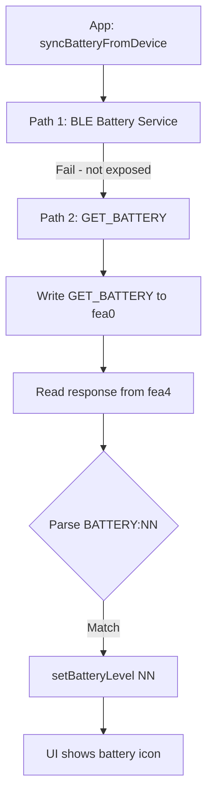

# Fix Battery Indicator Display

## Root Cause (Confirmed)

The investigation is correct. Codebase verification shows:

1. **Firmware does NOT handle GET_BATTERY** – The command handler in [toilet_kat_change/toilet_kat_change.ino](toilet_kat_change/toilet_kat_change.ino) (lines 824–995) handles GET_DEV_MODE, GET_FLUSH_COUNT, GET_HW_MATRIX, GET_LOGS, etc., but unknown commands receive `UNKNOWN_COMMAND:<cmd>` (line 993).
2. **Standard BLE Battery Service (0x180F) is not exposed** – The firmware only creates characteristics under the custom service UUID `5636340f-afc7-47b1-b0a8-15bc9d7d29a5`. No Battery Service.
3. **Battery level exists in firmware** – `getBatteryChargeLevel()` (lines 4828–4840) returns 0–100 from voltage (11.0V–12.6V linear). It is used internally for LOW_BATTERY_STOP and `displayBatteryChargeLevel()`.
4. **22-float params do not include battery level** – [buildParamCSV()](toilet_kat_change/toilet_kat_change.ino) (lines 5656–5679) includes `batteryThreshold` (index 0) but not the live battery percentage.
5. **Python client** – No GET_BATTERY; BATTERY appears only as a hardware component name.

---

## Solution: Add GET_BATTERY Command to Firmware

Add a new command handler that returns the battery level in a format the app can parse.

### 1. Firmware: Add GET_BATTERY Handler

**File:** [toilet_kat_change/toilet_kat_change.ino](toilet_kat_change/toilet_kat_change.ino)

Insert after `GET_FLUSH_COUNT` (around line 864):

```cpp
if (cmd == "GET_BATTERY") {
  int level = getBatteryChargeLevel();
  String batteryMessage = String("BATTERY:") + String(level);
  writeResponseToChannel(batteryMessage);
  Serial.printf("Processed GET_BATTERY, returned %s\n", batteryMessage.c_str());
  sendSerialToBLE("Processed GET_BATTERY");
  return;
}
```

**Response format:** `BATTERY:NN` (e.g. `BATTERY:85`). This matches the app regex `^BATTERY[:_]?\s*(\d+)\s*%?$/i` from the investigation.

### 2. Update BLE_APP_MIGRATION_SPEC.md

**File:** [toilet_kat_change/bluetooth interface app notes/BLE_APP_MIGRATION_SPEC.md](toilet_kat_change/bluetooth interface app notes/BLE_APP_MIGRATION_SPEC.md)

**a) Add `GET_BATTERY` to command examples** (line 50):

- Command channel examples: add `GET_BATTERY` to the list.
- Response channel examples: add `BATTERY:<n>` to the list.

**b) Add new section** (after Error Log Retrieval, before Trust Handshake):

```markdown
## Battery Level (GET_BATTERY)

Command `GET_BATTERY` retrieves the current battery charge level as a percentage. No trust handshake required.

### Protocol

- **Command**: `GET_BATTERY`
- **Response**: `BATTERY:<n>` where `<n>` is 0–100 (integer percentage)
- **Flow**: Client writes `GET_BATTERY` to command characteristic (`...fea0`), reads response from response channel (`...fea4`).
- **Parsing**: Extract the integer from `BATTERY:NN` (e.g. `BATTERY:85` → 85). Regex: `^BATTERY[:_]?\s*(\d+)\s*%?$/i` or equivalent.

### App use case

Use for battery status indicator in the UI. Poll periodically (e.g. on connect and every 30–60 seconds) to display charge level or low-battery warning.
```

### 3. Optional: Add GET_BATTERY to Python Client

**File:** [toilet_bluetooth_interface.py](toilet_bluetooth_interface.py)

Add a `get_battery()` helper that writes `GET_BATTERY` to the command characteristic and reads the response from the response characteristic, parsing `BATTERY:NN`. Keeps the Python client aligned with the spec.

### 4. App-Side (if needed)

If the app regex does not match `BATTERY:85`, extend it to accept that format. The regex `^BATTERY[:_]?\s*(\d+)\s*%?$/i` should already match `BATTERY:85`.

---

## Flow After Fix



---

## Alternative: Serial Stream Parsing

`displayBatteryChargeLevel()` sends `"Battery Voltage: X.XXV, Charge Level: XX%..."` over the serial stream when `START_SERIAL` is active. The app could parse this, but:

- Requires serial streaming to be enabled.
- Parsing free-form text is brittle.
- A dedicated command is simpler and more reliable.

---

## Verification

1. Flash updated firmware.
2. Connect app; confirm battery icon shows a value instead of "?".
3. Run Python client `get_battery()` (if implemented) and confirm `BATTERY:NN` response.
