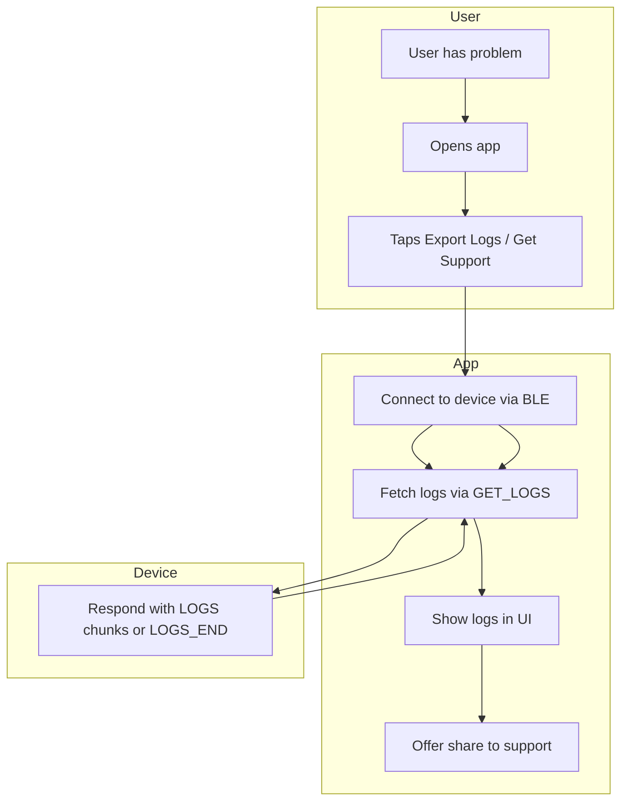

# Error Log App Specification

## Purpose

This specification defines how the mobile app should implement the "Get Support" / "Export Logs" workflow so users can retrieve device error logs and share them with the support team when troubleshooting.

---

## Workflow Overview



---

## User Flow

1. **Entry point**: User taps "Get Support", "Export Logs", "Diagnostics", or equivalent in the app.
2. **Connection**: App connects to the toilet device via BLE (if not already connected).
3. **Fetch**: App retrieves error logs using the chunked GET_LOGS protocol.
4. **Display**: App shows the logs in a readable format (scrollable text view).
5. **Share**: App offers to share logs via the system share sheet (email, support ticket, clipboard, etc.).

---

## BLE Protocol

### Prerequisites

- App must be connected to the device.
- **No trust handshake required** for GET_LOGS. User can export logs even if they cannot complete trust (e.g. broken flush button).

### Command / Response

| Step | App Action | Device Response |
|------|------------|-----------------|
| 1 | Write `GET_LOGS` or `GET_LOGS:0` to command characteristic (`...fea0`) | Response on `...fea4`: `LOGS:<offset>:<length>:<data>` or `LOGS_END` |
| 2 | Read from response characteristic (`...fea4`) | |
| 3 | If `LOGS:...`: parse offset, length, data; append data to buffer; write `GET_LOGS:<next_offset>` where next_offset = offset + length | |
| 4 | Repeat until response is `LOGS_END` | |

### Response Format

- **Chunk**: `LOGS:<offset>:<length>:<data>`
  - `offset`: byte offset in the log file (decimal string)
  - `length`: number of bytes in `data` (decimal string)
  - `data`: raw UTF-8 log content (may contain newlines, commas)
- **End**: `LOGS_END` when no more data or file is empty.

### Chunked Read Algorithm

```
buffer = ""
offset = 0
loop:
  cmd = (offset == 0) ? "GET_LOGS" : "GET_LOGS:" + offset
  write(cmd) to command characteristic
  sleep ~150ms
  response = read from response characteristic
  if response == "LOGS_END":
    break
  if response starts with "LOGS:":
    parse offset, length, data from response (split ":", 3)
    buffer += data
    offset += length
    if length < 450:
      break  // last chunk
  else:
    handle error, break
return buffer
```

### Safety Limits

- Cap iterations (e.g. 256) to avoid infinite loops on malformed firmware.
- Typical log file is ~8 KB; expect ~18 chunks at 450 bytes each.

---

## UI Requirements

### Export Logs Screen

1. **Header**: "Export Logs" or "Get Support"
2. **Status**: Connection state, fetch progress (e.g. "Fetching...", "Done", "Failed")
3. **Log display**: Scrollable text view showing the raw log content. Use monospace font for readability.
4. **Actions**:
   - **Share**: Opens system share sheet. Attach logs as plain text or .txt file.
   - **Copy**: Copy logs to clipboard.
   - **Retry**: Re-fetch if fetch failed.

### Empty State

- If logs are empty (device returns `LOGS_END` immediately): Show "No error logs recorded."
- Still offer Share/Copy with empty or minimal message so user can report "no logs" to support.

### Error States

| Condition | App Behavior |
|-----------|--------------|
| Not connected | Prompt to connect first, or auto-connect if possible |
| Fetch timeout | Show "Failed to retrieve logs. Check connection and try again." |
| Malformed response | Show "Log retrieval incomplete." with any partial data |
| BLE disabled | Prompt user to enable Bluetooth |

---

## Share Flow

1. User taps "Share with Support".
2. App opens system share sheet with:
   - **Subject** (if email): "Toilet device logs - [date]"
   - **Body**: Log content, optionally prefixed with device info (e.g. "Device: ESP32 Toilet\nDate: ...\n\n--- Logs ---\n...")
3. User selects channel (email, support ticket, messaging app, etc.).
4. App does not send automatically; user completes the share in the chosen app.

---

## Log Format (Informational)

Log entries are one line each, comma-separated. Example:

```
RST,12345,0,ESP_RST_BROWNOUT
ERR,12350,4,MOTOR_FAULT,step=5,cut=1,feed=0,bat=45,temp=82.3,m1A=0.5,heaterA=1.2,fan=forward
```

- **Type**: RST (reset), ERR (error), WARN (warning)
- **Timestamp**: millis since boot
- **Code**: numeric error code (0–7)
- **Message**: human-readable description
- **Context** (runtime errors): step, cut, feed, bat, temp, m1A, heaterA, fan

The app does not need to parse this format; display as-is. Support team will interpret.

---

## Implementation Checklist

- [ ] Add "Export Logs" / "Get Support" entry point in app navigation
- [ ] Implement chunked GET_LOGS read loop (write command, read response, repeat)
- [ ] Use response characteristic (`...fea4`) for reads, command characteristic (`...fea0`) for writes
- [ ] Show fetch progress and handle empty/malformed responses
- [ ] Integrate system share sheet with log content
- [ ] Add copy-to-clipboard option
- [ ] Handle disconnected state and BLE errors
- [ ] Do not require trust handshake for this flow

---

## References

- [BLE_APP_MIGRATION_SPEC.md](BLE_APP_MIGRATION_SPEC.md) – BLE UUIDs and channel responsibilities
- [toilet_bluetooth_interface.py](toilet_bluetooth_interface.py) – Python reference implementation (`get_error_logs()`)
