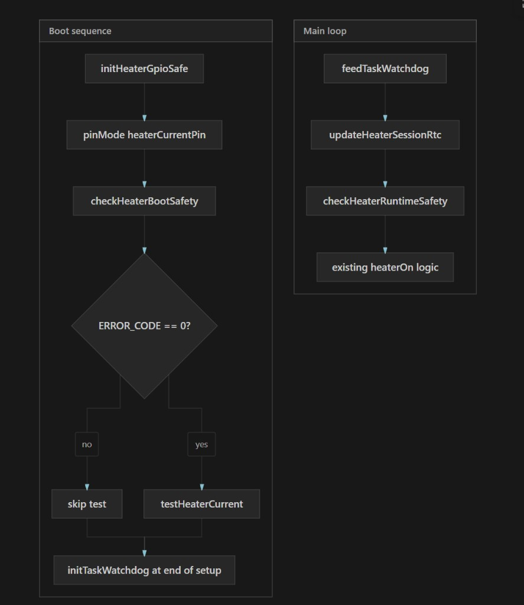

# Design Decision Rationale

## About this document

This document captures the reasoning behind the functionality in this project so we can understand why each decision was made and evaluate future changes against that rationale.

## EEPROM initialization strategy: detect virgin magic at runtime

When the firmware sees a virgin EEPROM header (`0xFFFF`), it now writes the in-firmware default parameters on first boot instead of requiring those parameters to be preflashed into EEPROM during manufacturing.

Rationale:

- Simpler production flow: only firmware flashing is required; no separate EEPROM data image generation, versioning, and flashing step.
- Better maintainability: default parameter changes live in one place (firmware source), reducing mismatch risk between code and factory images.
- Safer updates: if storage is erased during reflash or board replacement, the device can self-initialize to valid defaults automatically.
- Clear fault separation: virgin/uninitialized storage is treated as expected first-boot state, while non-virgin invalid magic is treated as genuine corruption and flagged as an error.
- Lower operational risk at scale: fewer manufacturing steps and fewer opportunities for process drift or stale parameter images.

## EEPROM error handling for a safety-critical toilet workflow

When EEPROM data is corrupt (non-virgin invalid magic), firmware rewrites default parameters so the toilet can continue operating, but keeps a latched EEPROM warning state (`ERROR_CODE = 7`) until parameters are successfully updated over Bluetooth.

Rationale:

- Product continuity first: for this device, degraded operation is preferable to full lockout so users can still use the toilet.
- Visible persistent alert: while the device is awake, the EEPROM warning LED remains illuminated to clearly signal maintenance is required.
- Controlled latch clearing: the EEPROM warning is only cleared after a verified BLE parameter write, preventing silent recovery without operator action.
- Wake-time awareness: after each wake from sleep, a 10-second alert pause keeps the warning visible before normal control resumes.
- Balanced behavior: users retain functionality while still being prompted to correct parameters for optimal heat-seal performance across supported bag materials.

## EEPROM error latch persistence over power cycles

The EEPROM error latch (`eepromErrorState`) is currently runtime-only (RAM) and is not persisted independently in non-volatile storage.

Implications:

- On each boot, firmware re-evaluates EEPROM health from the stored magic/header.
- If EEPROM magic is valid, the system boots without EEPROM error.
- If EEPROM is invalid/non-virgin, firmware rewrites defaults and sets `ERROR_CODE = 7` for that runtime session.
- A successful BLE parameter update clears the latched runtime EEPROM warning.
- Because the latch itself is not persisted, power cycling does not preserve the warning state on its own; warning reappearance depends on EEPROM validity at next boot.

## Heater over-temperature shutdown threshold

The firmware enforces a hard safety shutdown when measured heater temperature reaches 20% above the active target temperature.

Behavior:

- Safety threshold is computed as `active_target * 1.2`.
- In normal heating, `active_target` is the current PID setpoint (`K`).
- During cut-bag flushing, overheat protection uses the higher heating target (`max(K, CUT_MODE_TEMP)`) to avoid false trips while still preserving the 20% safety margin.
- If exceeded, firmware raises heater over-temp error (`ERROR_CODE = 3`), stops all relevant activity, and signals the fault via BLE/LED error handling.

Rationale:

- Protect hardware and surrounding components from runaway heating.
- Keep overheat logic proportional to the intended process temperature, rather than using a fixed absolute threshold.
- Maintain process continuity in cut mode by preventing premature shutdown at temperatures that are expected for `CUT_MODE_TEMP`, while preserving a clear safety boundary.

## Heater fail-safe firmware (crash and runaway monitoring)

Behavior:

- Early GPIO17 LOW in `setup()` before any intentional heater test (`initHeaterGpioSafe()`).
- Cold-boot reorder: heater safety (boot check, 5 s TWDT, current test) before BLE and LED startup animation.
- TWDT (5 s) with loop feeding (~5 ms typical iteration); reset releases GPIO to hardware pull-down (R35).
- Shutdown handler forces heater off on orderly restart (`esp_restart()`).
- RTC memory records whether heater was on across resets for post-crash forensics.
- Boot check: abnormal reset + (RTC flag or HS_OUT current) → `ERROR_CODE 8`.
- Boot check: current with GPIO off → MOSFET short suspicion.
- Runtime: sustained current with GPIO off; absolute 20 min output cap.
- Case 6 motor cuts and cold-boot motor homing are non-blocking so safety checks and TWDT feeding continue.
- Flush blocked until `motorHomingActive` is false and `motorHomingDeferred` is false.
- Light sleep: explicit `heaterOff()` before sleep.
- `testHeaterCurrent()` skipped when boot safety already latched an error.

Abnormal-reset persistent logging:

- After pin init, all abnormal reboots (task_wdt, wdt, panic, brownout, SDIO, int_wdt) append two SPIFFS lines: `reset` (reason/code/boot_ms) and `reset_forensics` (prior session heater snapshot + post-boot ADC/temp).
- Task TWDT resets report as `task_wdt` (code 6); `trigger_panic` may instead appear as `panic`.
- RTC memory stores pre-crash snapshot: uptime, heater temp (x10), PWM duty, flush step, cut-bag flag. Uses `RTC_NOINIT_ATTR` so data survives task-WDT reset on ESP32-S3 (plain `RTC_DATA_ATTR` is zeroed on software reset).
- Task WDT with `trigger_panic` typically appears as `panic` in the reset reason; the forensics line captures prior heater state regardless.
- Retrieve logs over BLE with `GET_LOGS` or paginated `GET_LOGS:<offset>` (existing command handler).

Rationale:

- Software complements hardware R35 pull-down (safe on reset) but cannot fix GPIO stuck HIGH during hang — 5 s TWDT bounds that window.
- Setup reorder minimizes the window where TWDT is disabled; heater test runs before long BLE init.
- Non-blocking motor cuts and homing avoid a class of bug where `delay()` disables over-temp and watchdog feeding.
- 5 s TWDT chosen because typical `loop()` is ~5 ms; non-blocking homing/flush means feed runs every iteration without special cases.
- HS_OUT provides independent confirmation of actual current, not just GPIO belief.
- RTC forensics distinguish "crashed while heating" from benign resets.
- Forensics logging runs after pins are ready so post-reset ADC/temp are meaningful; `initErrorLog()` only mounts SPIFFS.
- Absolute on-time is a backstop independent of flush state machine / PID.
- Software-only protection is not a substitute for a thermal fuse or hardware watchdog on the heater power path.

## Brownout and low-battery voltage guard

Behavior:

- **Usable battery assessment** (`assessBatteryUsable`): user-facing battery % (LED bar, `GET_BATTERY`, flush block) is derived from a scaled heater load pulse, not idle open-circuit VMON. Assessment steps through duties up to `getHeaterPwmCapForVoltage(vIdle)`, records worst loaded voltage/sag, and maps usable % from `MIN_LOADED_BATTERY_V` (0%) to `USABLE_V_FULL` (100%).
- **Unified flush block**: `batteryThreshold` (default 7 = one LED on a 14-LED bar) is the minimum usable % before flush. Flush is blocked at the button handler and re-checked in flush case 0; both use the same cached assessment.
- **Loaded VMON preflight** (`measureBatteryUnderLoad`, legacy helper): still available for single-step tests; boot/flush/homing paths now use `assessBatteryUsable` instead of idle % plus light-duty-only load test.
- **Boot brownout streak**: RTC `BrownoutRtc` counter increments on brownout reset; when streak ≥ `BROWNOUT_STREAK_LIMIT`, boot heater test is skipped.
- **Ramped boot heater test** (`testHeaterCurrent`): PWM ramps up to assessed `capDuty` instead of always targeting full duty at boot.
- **Flush case 0 gates**: preflight (usable battery assess, motor faults, heater current test) before entering the flush sequence; failures latch `ERROR_CODE 2` via `latchLowBatteryStop`.
- **Runtime PWM derate** (`getEffectiveHeaterPwmCap`, `updateHeaterPID`): heater duty capped when VMON sags during operation; one-tier conservative derate when preflight `vLoadWorst` is within `PREFLIGHT_CAP_MARGIN_V` of `MIN_LOADED_BATTERY_V`.
- **Runtime sag debounce**: `checkRuntimeSagDebounced` requires `RUNTIME_SAG_STRIKES` consecutive low VMON samples before latching low battery mid-heat.
- **M1/heater mutual exclusion**: heater is not armed until case 5 close completes (end of case 5 before case 6); `isM1MotorActive()` blocks heater PID while M1 runs; heat timers pause during M1 motion.
- **Diagnostics**: `logPowerTestEvent()` writes `power_test` lines to Serial, BLE (when streaming), and SPIFFS for assessment steps, boot skip, flush preflight, and heater ramp outcomes.

Rationale:

- Idle VMON misses load sag; a pack can look healthy at rest but collapse under heater or M1 stall current.
- Light-duty-only preflight (duty 64) passed while full heat PWM failed mid-cycle; scaled assessment matches runtime stress.
- LED bar, `GET_BATTERY`, and flush gates must share one usable metric so the operator is not misled before starting a cycle.
- Parallel heater + M1 clamp causes stall-level brownouts; deferring heat until the mechanism is closed avoids the worst combined load.
- Full-PWM heater test at boot can reset-loop a weak battery; ramped test and skip-on-streak reduce that risk.
- Loaded preflight aligns boot heater test, flush case 0, and deferred homing retry on the same battery gate.
- `power_test` SPIFFS events complement abnormal-reset forensics for field diagnosis without a debugger.
- **Dual-button battery report**: idle dual press runs `assessBatteryUsable("display")` then emits a structured `=== BATTERY ASSESS ===` block on USB Serial (and BLE serial when streaming is enabled) with per-step vLoad, sag, heater ADC/current, and summary thresholds. SPIFFS context logging uses quiet ADC reads to avoid debug spam.

### Verification checklist (bench)

1. **Full pack**: dual-button display shows most LEDs; `[display]` assessment logs pass at high duty; flush starts.
2. **Marginal pack (~11.45 V idle)**: usable % near one LED; flush blocked at button with `Flush blocked: usable=...`; no mid-heat ERROR 2.
3. **Prior failure scenario**: confirm scaled preflight fails or blocks before heat phase when idle VMON still reads ~11.47 V.
4. **Charge recovery**: deferred homing retry uses `assessBatteryUsable`; ERROR 2 clears only after successful homing.
5. **Logs**: SPIFFS/serial `power_test` entries include assessment `step_result`, `vLoadWorst`, `usable`, and `flushAllowed`.
6. **Dual-button report**: structured `=== BATTERY ASSESS ===` on Serial; per-step heater ADC/current; no `Battery Debug` spam during assess; BLE lines only when streaming enabled.

## Motor homing deferred on low battery

Behavior:

- Cold boot runs battery/brownout preflight (same gates as boot heater test) before `startMotorHoming()`.
- Homing is **skipped** when battery preflight fails, brownout streak caused heater-test skip, or NVS `homing_deferred` is already set from a prior session; M1 is not run on a weak pack.
- Deferred state is persisted in NVS (`homing_deferred`, optional `homing_defer_reason` string) so position-unknown survives reboot and charge cycles.
- `ERROR_CODE = 2` and the error LED are latched while deferred (mechanism not at known position / charge required).
- `loop()` polls every ~5 s via `tryStartDeferredHomingIfReady()`; when battery preflight passes, homing auto-retries; deferred state and `ERROR_CODE 2` clear only on homing success in `updateMotorHoming()`.
- Flush start is blocked while `motorHomingDeferred`; flush case 0 battery gates remain as redundant safety.
- Deep-sleep wake does not run homing (unchanged); deferred retry logic in `loop()` still applies. NVS reload on wake re-applies `ERROR_CODE 2` via `applyLoadedMotorHomingDeferred()`.
- `logPowerTestEvent("homing_defer", ...)` records boot skip, retry checks, retry start, and completion.

Rationale:

- M1 homing draws stall-level current; on a very low battery it can brownout the ESP like the heater test or flush clamp.
- Skipping homing without persistence leaves the unit unaware after recharge: mechanism position unknown, flush unsafe, no operator signal.
- NVS flag (not RAM-only `ERROR_CODE`) survives power cycle; re-applying `ERROR_CODE 2` on boot when the flag is loaded gives visible LED indication.
- Auto-retry on battery recovery avoids requiring a power cycle after charging; the operator does not need to know internal state.
- `ERROR_CODE 2` is cleared only after successful homing, not when voltage merely recovers — position is the gating concern, not voltage alone.
- Flush blocked while deferred prevents entering case 0 motor/heater sequence with unknown mechanism state.
- Aligns with the non-blocking homing design in the heater fail-safe section: homing stays async in `loop()`, TWDT feeding continues.

See also **Brownout and low-battery voltage guard** above for loaded VMON preflight, brownout streak, and M1/heater mutual exclusion.

## BLE timeout behavior when clients stay connected

BLE auto-shutdown now uses an idle timer that respects serial streaming state:

- If serial streaming is active, BLE remains enabled and the idle timer is continuously refreshed.
- If serial streaming is not active, BLE can auto-shutdown after 10 minutes even if a client remains connected (to close accidental idle connections).
- After wake from sleep, BLE is initialized and advertised again with a fresh idle timer, so maintenance tools can reconnect without requiring a power cycle.
- When streaming stops or the client disconnects, BLE timeout behavior resumes from the idle timer and is re-evaluated continuously in the main loop.

Rationale:

- Preserve active diagnostics sessions: live serial monitoring should not be interrupted by a background BLE timeout.
- Avoid accidental battery drain: a forgotten/stale BLE connection without streaming should not keep radio power on indefinitely.
- Keep wake behavior serviceable: every wake should reopen the normal diagnostics/configuration window while retaining the 10-minute idle shutdown.
- Match operator intent: starting serial stream is treated as explicit "keep BLE alive" activity.
- Keep behavior predictable after session end: once streaming/disconnect transitions the link to idle, the same 10-minute idle shutdown policy applies.
- Improve shutdown safety: BLE send paths are guarded by `bleEnabled`, and streaming/connection state is cleared before BLE deinit to avoid stale-notify behavior during shutdown.

## Open microswitch latch during flush (cases 8–10)

During the post-cooling open phase, firmware uses `openSwitchLatched` to record the first time the open microswitch (`microswitchOpenPin`) reads LOW, then continues the timed post-open sequence even if the switch reads HIGH again.

**Behavior**:

- Latch is cleared when the open phase starts (case 7), on `stopEverything()`, and when advancing from case 10 to case 11.
- Latch is set on first LOW read in case 8 or case 10; M1 is stopped at that point.
- Once latched, backup → fan → feed steps run on timers (`backupTimeAfterReopen`, `postCoolingFanDuration`, `continueFeeder`) without requiring the switch to stay LOW.
- Open-phase timeout uses `motorStartMillis` from case 7 and `maxOpeningTime`, but only while `!openSwitchLatched` (waiting for first LOW read). After latch, post-open steps use their own timers and are not subject to `maxOpeningTime`.
- `sw10` debug output is logged only on state change to avoid BLE spam.

**Rationale**:

- The open switch is a momentary end-of-travel indicator, not a “held closed” interlock. Requiring LOW for the entire backup/fan/feed chain is incorrect for this hardware.
- Switch bounce, mechanical overshoot, or brief release after trigger can cause LOW → HIGH transitions in production (not only during manual bench testing). Without a latch, M2 backup can start and then stall with no path to advance, leaving motors running indefinitely.
- Latch-on-first-detection matches the intended process: “open complete” is an event; subsequent steps are time-based.
- `maxOpeningTime` protects only the unlatched open-wait phase; if the switch never latches within that window, ERROR_CODE 1 is raised.

**Close side (case 5) — latch intentionally not used**:

- The close microswitch near the heater **must be closed and held closed** for safe sealing and heating. Case 5 requires the switch to read LOW and additionally confirms M1 load current (`> 0.5 A`) before stopping the close motor and advancing.
- If the close switch opens again, the mechanism is no longer in a verified sealed state; firmware should not treat a momentary close as completion. A latch on the close side would incorrectly allow progression after the mechanism had opened.
- Close-phase timeout is enforced in case 5 via `motorStartMillis` and `maxOpeningTime` (default 16.5 s).

## Flush cancel recovery

During an active flush, the user can cancel via control panel input (button 1, button 2, or the GPIO2 wake line). Cancel does **not** immediately call `stopEverything()`; instead, firmware runs a temperature-aware recovery sequence so the sealer ends in a safe, open, ready state for the next flush.

**Cancel input and `flushCancelArmed`**:

- Cancel sources are the same as flush/feed buttons plus the wake line (`readFlushCancelInput()`).
- **Dual-button press during flush** bypasses `flushCancelArmed` and calls `acceptFlushCancel()` immediately (original “press both to cancel” gesture). Handled in the dual-button block before the single-button flush cancel logic runs.
- Single-button / wake-line cancel uses `flushCancelArmed`: while flushing, firmware sets it when all cancel inputs are **released**, and cancel fires only on a **new** press while armed. This prevents the hold-to-start-flush press from instantly cancelling the flush it just started.
- `flushCancelArmed` is cleared as soon as cancel is accepted (`abortFlushForCancel()`), on flush start, on normal flush complete (case 13), in `clearFlushStateForCancel()`, and in `stopEverything()`.

**Recovery flow** (via `abortFlushForCancel()`):

1. Stop active flush operations immediately: heater off, M2 feed stopped, cut/precool flags cleared, fan off.
2. Read thermistor temperature and branch:
   - **Cold** (`temp < COOL_OPEN_TEMP_C`, default 80 °C): skip cooling. If the mechanism moved from its open ready position (`flushStep >= 2` or open microswitch not LOW), run `startMotorHoming()` via `beginCancelRecoveryHoming()`. If already open and ready (typically flush steps 0–1), call `completeCancelRecoveryReady()` immediately.
   - **Hot** (`temp >= COOL_OPEN_TEMP_C`): enter dedicated flush step **14** (`FLUSH_STEP_CANCEL_COOL`) and passively cool with the mechanism closed until `temp < COOL_OPEN_TEMP_C` or `MAX_COOL_WAIT_S` timeout, then call `beginCancelRecoveryHoming()`.

**Hardware constraint used in routing**: the main thermistor only reads above 80 °C when the mechanism is closed. A hot reading therefore implies the sealer is already closed; no separate “finish close” step is required before cooling.

**Opening / reset path (shared for hot and cold)**:

- Both paths use existing **`startMotorHoming()`** (partial-close confirm → open full), not the normal flush cases 7–8 open sequence. Cases 7–8 start M2 feed and run a timed bag backup; those steps are intentionally skipped on cancel.
- **`completeCancelRecoveryReady()`** is the single “ready for next flush” exit for every path: flush state cleared, `lastActivityMillis` refreshed, dev log `cancel_complete`, **no flush count increment**. When homing was required, it runs from `updateMotorHoming()` when the open switch latches; when the mechanism was already open, it runs immediately after cancel.

**Case 14 (cancel cool only)**:

- Derived from case 7 cooling logic but with **no motor motion** during the cool-down.
- Re-cancel is ignored while `flushStep == 14`.
- Cancel ack: 3× all-LED flash + buzzer (`playHardwareNotConnectedAlert()`, 80 ms on/off).
- Recovery UX: `flushCancelRecoveryActive` keeps all 14 LEDs on until `cancel_complete` (no flush progress bar or cooling drain during case 14 or homing).

**Guards**:

- New flush start remains blocked while `isFlushing` (including case 14) or `motorHomingActive`.
- Dual-button press during flush uses `acceptFlushCancel()` (same recovery as single-button cancel), not `stopEverything()`.
- Dual-button press while busy but not flushing (manual feed, homing, etc.) uses `stopEverything()` as a hard stop.
- Fault paths and OTA enable still use `stopEverything()`, which clears `cancelRecoveryHomingPending`.
- Normal flush post-open tail (cases 8–13) is never entered on cancel recovery.

**Rationale**:

- Cancelling mid-flush must leave the device safe and usable: a closed, hot sealer is not ready for the next cycle.
- Temperature-based routing minimizes delay when cold (fast homing or immediate ready) while enforcing cool-down when the heater has been active.
- Reusing `startMotorHoming()` for all open/reset paths avoids duplicating open logic and matches the established “known open position” routine used elsewhere.
- Dedicated case 14 avoids patching cases 7–8, which couple open with bag feed and backup timers inappropriate for cancel.
- `flushCancelArmed` clearing at cancel accept prevents held-button re-entry into cancel logic during case 14 while `isFlushing` remains true.
- Cancel recovery LED UX (ack flash, then all-on until complete) gives a distinct operator signal without reusing the flush progress bar, which would misrepresent passive cool/homing as normal flush progress.
- A single `completeCancelRecoveryReady()` exit keeps cold-immediate and homing-complete paths equivalent for operators and diagnostics.

## Heater tolerance gap enforcement policy (2C minimum)

The system now enforces a minimum 2C separation between `heaterLowerToleranceC` and `heaterUpperToleranceC` using a split policy:

- Bluetooth interface (`toilet_bluetooth_interface.py`) performs strict validation and rejects updates when `heaterUpperToleranceC - heaterLowerToleranceC < 2.0`.
- Firmware (`toilet_kat_change.ino`) acts as a safety backstop for non-compliant clients by auto-correcting invalid pairs to `heaterLowerToleranceC = heaterUpperToleranceC - 2.0` and continuing operation.

Rationale:

- Operator-facing tools should fail fast and clearly when a parameter set is invalid.
- Firmware must remain resilient even if a third-party or stale client bypasses interface validation.
- The chosen correction direction prioritizes keeping the requested upper bound while lowering the ON threshold, which preserves process continuity and biases behavior toward safer/lower heating when payloads are malformed.
- Applying the same normalization at BLE ingest and EEPROM load prevents legacy or corrupted persisted values from violating the minimum gap rule after reboot.

## Error log persistence and BLE retrieval

The firmware persists error codes, crashes, brownouts, and runtime faults to a file on SPIFFS, retrievable over BLE via chunked `GET_LOGS` so users can share logs with support when troubleshooting.

**What is logged**:

- **Reset/crash/brownout**: `esp_reset_reason()` at boot for unexpected resets (panic, WDT, brownout, SDIO). Normal power-on and software resets are skipped.
- **Runtime errors**: When `LEDErrorCode()` is called (ERROR_CODE 1–7): motor timeout, low battery, heater overheat, motor fault, heater current fail, heater max wall time, EEPROM invalid.
- **EEPROM invalid**: Full reason from `enterEEPROMInvalidErrorState()`.
- **OTA failures**: When `setOTAState(OTA_ERROR)` is invoked.
- **OTA boot diagnostics**: `ota_boot`, `ota_boot_fail`, `ota_rollback`, `ota_boot_ok`, `ota_spiffs_capture` while verifying or running a recently OTA-installed partition. NVS snapshot available via `GET_OTA_DIAG`.
- **MCP unavailable**: When I2C expander init fails after retries.
- **Power tests** (`power_test` log type): Battery/heater preflight, boot heater skip, flush case 0 gates, loaded VMON measurements, and `homing_defer` events (boot skip, retry, completion) via `logPowerTestEvent()`.

**Context for runtime errors**: Each runtime error log includes flush/feed state (`step`, `cut`, `feed`), sensor values (`bat`, `temp`, `m1A`, `heaterA`), and fan status (`off`, `forward`, `reverse`) to aid diagnostics.

**Storage**: SPIFFS file `/errors.txt`. Max 8 KB; when full, oldest entries are dropped. Line length capped at 200 chars.

**Retrieval**: BLE command `GET_LOGS` or `GET_LOGS:<offset>`. Response `LOGS:<offset>:<length>:<data>` (chunked, ~450 bytes per chunk) or `LOGS_END`. Also `GET_OTA_DIAG` for NVS OTA rollback metadata. No trust handshake required so diagnostics work even when the user cannot complete trust (e.g. broken flush button).

**Rationale**:

- Support needs visibility into device failures; on-device logs survive power cycles and are accessible without a debugger.
- Bounded size prevents unbounded flash wear and memory use.
- Chunked retrieval fits BLE MTU limits (~512 bytes).
- No auth for GET_LOGS keeps diagnostics available when trust flow cannot be completed.
- Rich context (flush step, sensors, fan) helps support correlate failures with process state.

## Hardware matrix history and rollback metadata (on-device, offline)

The hardware matrix stores both current and previous values per component directly on-device (no cloud dependency) so service users can inspect what was installed before an upgrade and support rollback workflows.

Per component, the persisted record should include:

- `current_version`
- `current_description`
- `install_date` (ISO 8601 date, `YYYY-MM-DD`)
- `previous_version`
- `previous_description`
- `previous_install_date` (ISO 8601 date, `YYYY-MM-DD`)

Update logic (single component update over BLE):

1. Validate component name and payload bounds.
2. Read existing component record.
3. Copy current fields to previous fields:
   - `previous_version = current_version`
   - `previous_description = current_description`
   - `previous_install_date = install_date`
4. Write new current fields from request:
   - `current_version = new_version`
   - `current_description = new_description`
   - `install_date = new_install_date` (ISO 8601)
5. Persist and verify write success before ACK.

Rationale:

- Enables offline serviceability: technicians can see pre-upgrade component metadata without network access.
- Supports practical rollback decisions by preserving immediate historical context on-device.
- Keeps storage bounded and deterministic by retaining one previous snapshot per component (instead of unbounded history).
- Provides consistent parsing/sorting across firmware and Python tools by standardizing date format to ISO 8601.

## Control panel pinout versioning (CONTROL_PANEL v5 vs v6)

The control panel uses an MCP23017 I/O expander (I2C `0x20`) for LEDs and button inputs.

**Background**:

- Original control panel **v5** had a pin-assignment bug on the MCP: button 2 was wired to MCP pin 15 (GPB7, output-only on this design), and button 1 was routed directly to ESP32 **GPIO2** for wake and flush.
- Revised control panel **v6** moves both buttons to valid MCP input pins (button 1 → MCP pin 6 / GPA6, button 2 → MCP pin 14 / GPB6) and adds a **diode-OR** so either button pulls **SW1** (GPIO2) low to wake the main board from sleep.

**Pinout table** (firmware read paths):

| Function | CONTROL_PANEL v5 (legacy) | CONTROL_PANEL v6 (new) |
|----------|---------------------------|------------------------|
| Button 1 (flush) | ESP32 GPIO2 | MCP23017 pin 6 |
| Button 2 (feed) | MCP23017 pin 15 | MCP23017 pin 14 |
| Wake / light sleep | GPIO2 (button 1 only) | GPIO2 via diode-OR (both buttons) |
| LED MCP pins (UI indices 3 and 5) | MCP 14, MCP 6 | MCP 15, MCP 7 |

Full 14-LED UI-order tables in firmware:

- **v5** (`ledPinsV5`): `{1, 9, 13, 14, 10, 6, 11, 12, 8, 0, 2, 3, 4, 5}`
- **v6** (`ledPinsV6`): `{1, 9, 13, 15, 10, 7, 11, 12, 8, 0, 2, 3, 4, 5}`

On v6, MCP pins 6 and 14 are reserved for buttons; the two LEDs that were on MCP 14 and 6 in v5 move to MCP 15 (GPB7) and 7 (GPA7).

**Firmware behavior**:

- Pinout is selected from the on-device hardware matrix component `CONTROL_PANEL` (`5` = legacy, `6` = new). Unknown versions default to v5 for backward compatibility with deployed units.
- LED I/O uses `getLedPin(uiIndex)` to resolve the active `ledPinsV5` / `ledPinsV6` table; MCP LED outputs are configured separately from button inputs so v6 never drives pins 6/14 as LEDs.
- Button state for flush/feed/battery gestures is read through version-aware helpers; GPIO2 is **not** used for flush/feed discrimination on v6 (reading GPIO2 there would falsely report button 1 when button 2 is pressed, because both share the wake line). GPIO2 **is** still used for wake, light/deep sleep, and BLE trust confirmation on all panel versions.
- Deep sleep and inactivity light sleep continue to wake on GPIO2 LOW for both versions; on v6 this is correct because hardware ORs both switches onto SW1.
- Optional compile-time `CONTROL_PANEL_PINOUT_OVERRIDE` (5 or 6) forces pinout during development without changing NVS.

**Configuration paths**:

- **Field / production**: `SET_HW_COMPONENT:CONTROL_PANEL|...` or full HWCFG apply (`HWCFG_APPLY_CHANGE`) after setting `CONTROL_PANEL` version to `6`. Reconfigures MCP button inputs and LED outputs immediately when MCP is available.
- **Development**: `#define CONTROL_PANEL_PINOUT_OVERRIDE 6` at top of firmware.

**Rationale**:

- **Single firmware binary**: one image supports both board revisions; pinout is data (hardware matrix version), not a separate build.
- **Safe default**: factory default remains v5 so existing installed base is unaffected until a technician explicitly records a v6 panel.
- **Separation of wake vs logic**: wake stays on GPIO2 (RTC-capable, already integrated with sleep paths); distinct button actions on v6 require MCP reads on the corrected pins.
- **Hardware matrix integration**: reuses existing offline component versioning, previous-version history, and BLE tooling rather than a new config mechanism.
- **Pin-only HWCFG**: v6 is a wiring change, not a parameter change; empty parameter profiles are permitted for `CONTROL_PANEL` so apply does not require dummy tuning values.
- **Field serviceability**: boot log and BLE serial report active pinout so support can confirm configuration matches the physical panel installed.

## BLE trust confirmation uses GPIO2 (SW1), not version-aware button reads

The BLE trust handshake requires a physical button press near the device before privileged commands (parameter writes, hardware updates) are allowed.

**Behavior**:

- Firmware always reads ESP32 **GPIO2** (`controlPanelWake` / connector **SW1**) to confirm trust during `TRUST_WAITING`, regardless of `CONTROL_PANEL` version.
- **v5**: GPIO2 is wired to the flush button only; only flush confirms trust.
- **v6**: GPIO2 is driven by a diode-OR from both panel buttons; either button confirms trust. Flush vs feed for normal operation still uses MCP pins 6 and 14 respectively.
- Trust is a proximity gate, not a flush action; using GPIO2 keeps pairing compatible with all control panel revisions and aligned with wake/sleep paths (no MCP dependency for trust).

**Rationale**:

- One stable confirmation signal across v5 and v6 without duplicating pinout logic in the trust path.
- Matches hardware wake wiring on v6 (both buttons already pull SW1 low).
- Avoids trust failures when MCP expander reads differ from the GPIO2 wake line.

## Hardware DEV mode toggle via dual-button hold

Holding both control panel buttons for 10 seconds while **DEV mode is off** enables persisted DEV mode via `setDevModeEnabled(true)`. A short simultaneous dual press behaves differently depending on whether the device is idle.

When **DEV mode is on**, the same dual-button hold gesture does **not** turn DEV mode off at 10 seconds. Instead, at 10 seconds the device gives warning feedback (double beep + brief LED flash). If both buttons remain held for **20 seconds total** from the idle battery path, the device performs a **factory firmware rollback** (same outcome as BLE `OTA_ROLLBACK_FACTORY`). Turn DEV mode off via BLE `SET_DEV_MODE:0` or the app.

**Behavior**:

- **Idle** (`isDeviceIdleForDualButton()`): short dual press stops any stray state via `stopEverything()`, shows battery level on the LEDs, and starts the dual-button hold timer. LEDs auto-clear a few seconds after release.
- **Not idle** (flushing, homing, manual feed, mechanism/fan motion): short dual press does **not** show battery. If flushing, runs flush cancel recovery via `acceptFlushCancel()`. Otherwise calls `stopEverything()` as a hard stop.
- **DEV off**, 10-second continuous dual hold: enable DEV mode (persisted in NVS); only from the idle battery path (`dualButtonHoldActive`); blocked while an OTA window is active.
- **DEV on**, 10-second hold: warning only (no DEV toggle off).
- **DEV on**, 20-second continuous dual hold: factory partition rollback and reboot; same idle/OTA guards as the DEV-on path above.
- OTA firmware updates are app-only: send `ENABLE_OTA` over BLE; there is no hardware path to OTA mode.

**Rationale**:

- OTA entry via a hidden button sequence is redundant now that the app handles firmware updates.
- A hardware DEV mode toggle remains useful for field debugging (BLE stays on, inactivity sleep disabled) without requiring the app.
- Factory rollback via hardware is deliberately hard to trigger (DEV on + 20 s hold while idle) to avoid accidental customer rollbacks.
- Battery display is only meaningful when idle; during active operations dual press should cancel or stop, not show battery level.
- Dual-button flush cancel predates single-button cancel and must work on first simultaneous press without the `flushCancelArmed` release-then-press debounce.

## BLE payload chunking in the Python client

The Python BLE client (`toilet_bluetooth_interface.py`) splits large writes into chunks when sending to GATT characteristics.

**Why**: BLE GATT writes are limited by the ATT MTU. Each `write_gatt_char` call can send at most `MTU - 3` bytes (3 bytes reserved for ATT protocol overhead). The default MTU is 23 bytes, so only ~20 bytes can be sent per write. Even with negotiated MTU (e.g. 185), payloads larger than `MTU - 3` must be split.

**What gets chunked**: Parameter writes (22-float CSV), long commands, and any framed payloads that exceed the per-write limit. The client uses `_write_ble_payload_chunked` to split payloads and send them sequentially.

**Rationale**:

- BLE_APP_MIGRATION_SPEC does not require framed payloads; the protocol is plain UTF-8. Chunking is a transport-layer necessity, not a protocol requirement.
- Chunk size is derived from `client.mtu_size` (or 23 if unknown) minus 3.
- Optional `BLE_CHUNK_PACING_S` allows inserting delays between chunks to avoid overwhelming slower stacks (e.g. some Android BLE implementations).
